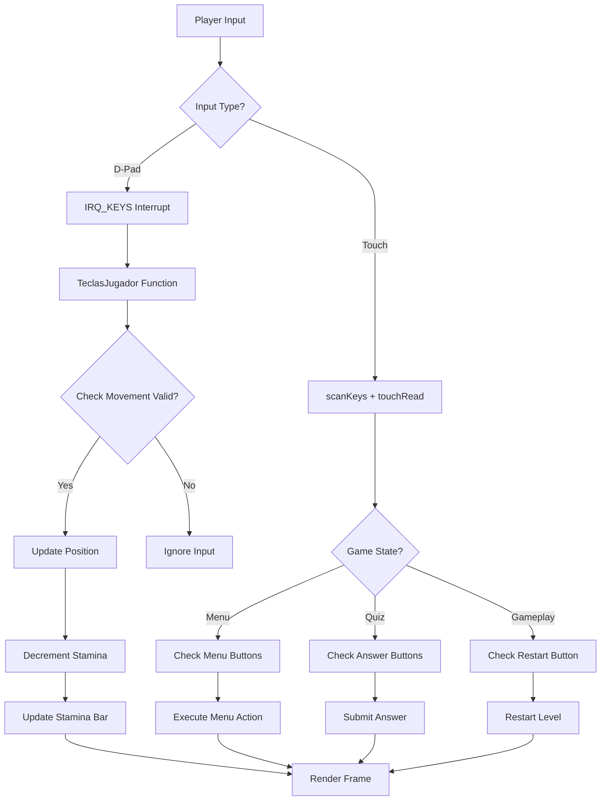

## Control Overview

Una Aventura Inesperada utilizes both Nintendo DS screens:

- **Top Screen:** Game world (tile-based puzzle grid)
- **Bottom Screen:** HUD, menus, dialogs, and touch controls

<Info>
The game uses hardware interrupts for responsive input handling via `ConfigurarInterrupciones()` (source/main.c:242-260).
</Info>

## D-Pad Movement

The D-pad controls player movement on the grid. Movement is handled by the `TeclasJugador()` interrupt function (source/main.c:271-437).

### Movement Keys

<CardGroup cols={2}>
  <Card title="Up" icon="arrow-up">
    **D-Pad Up**
    
    `REG_KEYINPUT == 0x03BF`
    
    Moves player 2 tiles north
  </Card>
  
  <Card title="Down" icon="arrow-down">
    **D-Pad Down**
    
    `REG_KEYINPUT == 0x037F`
    
    Moves player 2 tiles south
  </Card>
  
  <Card title="Left" icon="arrow-left">
    **D-Pad Left**
    
    `REG_KEYINPUT == 0x03DF`
    
    Moves player 2 tiles west
  </Card>
  
  <Card title="Right" icon="arrow-right">
    **D-Pad Right**
    
    `REG_KEYINPUT == 0x03EF`
    
    Moves player 2 tiles east
  </Card>
</CardGroup>

### Input Values

The `REG_KEYINPUT` register contains button states. Each direction has a unique hexadecimal value:

```c
// From source/main.c:274-436
REG_KEYINPUT == 0x03BF  // Up
REG_KEYINPUT == 0x037F  // Down
REG_KEYINPUT == 0x03DF  // Left
REG_KEYINPUT == 0x03EF  // Right
```

<Accordion title="Understanding REG_KEYINPUT Values">
  The NDS `REG_KEYINPUT` register uses inverted logic (0 = pressed, 1 = released):
  
  - Bit 0: A button
  - Bit 1: B button
  - Bit 2: Select
  - Bit 3: Start
  - Bit 4: Right
  - Bit 5: Left
  - Bit 6: Up
  - Bit 7: Down
  - Bits 8-9: R/L triggers
  
  The values `0x03BF`, `0x037F`, etc. represent specific button combinations where only the directional bit is 0 (pressed).
</Accordion>

### Movement Execution

<Tabs>
  <Tab title="Up Movement">
    ```c
    // From source/main.c:274-321
    if (movimientosJugador > 0 &&           // Have stamina
        REG_KEYINPUT == 0x03BF &&           // Up pressed
        posJugFila > 0 &&                    // Not at top edge
        esPartidaAcabada == false &&         // Game active
        mapMemory[(posJugFila-1)*32+posJugColumna] != 18 &&  // Not void
        mapMemory[(posJugFila-1)*32+posJugColumna] != 28){   // Not wall
        
        // Check for obstacles
        if(mapMemory[(posJugFila-2)*32+posJugColumna] == 19){
            MoverObstaculo(0);  // Push box up
        }
        else if(mapMemory[(posJugFila-2)*32+posJugColumna] == 5 || 
                mapMemory[(posJugFila-2)*32+posJugColumna] == 42){
            MoverEnemigo(0, enemActual);  // Push enemy up
        }
        
        // Execute movement if path is clear
        if(mapMemory[(posJugFila-2)*32+posJugColumna] != 19 && 
           mapMemory[(posJugFila-2)*32+posJugColumna] != 5 && 
           puedeJugadorMoverse == true){
            
            // Restore old tiles
            mapMemory[(posJugFila)*32+posJugColumna] = ComprobarSuelo(...);
            // ... restore other 3 tiles
            
            posJugFila -= 2;  // Update position
            
            // Draw player at new position
            mapMemory[posJugFila*32+posJugColumna] = ElegirFondoJugador(0, ...);
            // ... draw other 3 tiles
        }
        
        movimientosJugador--;  // Consume stamina
        ActualizarBarraMovimientos();  // Update UI
    }
    ```
  </Tab>
  
  <Tab title="Down Movement">
    ```c
    // From source/main.c:323-359
    if (movimientosJugador > 0 &&
        REG_KEYINPUT == 0x037F &&
        posJugFila+1 < 23 &&  // Not at bottom edge
        esPartidaAcabada == false &&
        mapMemory[(posJugFila+2)*32+(posJugColumna+1)] != 18 &&
        mapMemory[(posJugFila+2)*32+(posJugColumna+1)] != 27){
        
        // Obstacle checks (box/enemy)
        
        if(/* path clear */){
            posJugFila += 2;  // Move down
            // Update tiles
        }
        
        movimientosJugador--;
        ActualizarBarraMovimientos();
    }
    ```
  </Tab>
  
  <Tab title="Left Movement">
    ```c
    // From source/main.c:362-398
    if (movimientosJugador > 0 &&
        REG_KEYINPUT == 0x03DF &&
        posJugColumna > 0 &&  // Not at left edge
        esPartidaAcabada == false &&
        mapMemory[(posJugFila)*32+(posJugColumna-1)] != 18 &&
        mapMemory[(posJugFila)*32+(posJugColumna-1)] != 24 &&  // Left wall
        mapMemory[(posJugFila)*32+(posJugColumna-1)] != 27){
        
        // Obstacle checks
        
        if(/* path clear */){
            posJugColumna -= 2;  // Move left
            // Update tiles
        }
        
        movimientosJugador--;
        ActualizarBarraMovimientos();
    }
    ```
  </Tab>
  
  <Tab title="Right Movement">
    ```c
    // From source/main.c:399-436
    if (movimientosJugador > 0 &&
        REG_KEYINPUT == 0x03EF &&
        posJugColumna+1 < 31 &&  // Not at right edge
        esPartidaAcabada == false &&
        mapMemory[(posJugFila+1)*32+(posJugColumna+2)] != 18 &&
        mapMemory[(posJugFila+1)*32+(posJugColumna+2)] != 17 &&  // Right wall
        mapMemory[(posJugFila)*32+(posJugColumna+2)] != 26){
        
        // Obstacle checks
        
        if(/* path clear */){
            posJugColumna += 2;  // Move right
            // Update tiles
        }
        
        movimientosJugador--;
        ActualizarBarraMovimientos();
    }
    ```
  </Tab>
</Tabs>

### Movement Constraints

Every movement input must satisfy these conditions:

<Steps>
  <Step title="Stamina Check">
    `movimientosJugador > 0` - At least 1 movement remaining
  </Step>
  
  <Step title="Button Check">
    `REG_KEYINPUT == [direction value]` - Specific direction pressed
  </Step>
  
  <Step title="Boundary Check">
    Position not at map edge (0-31 columns, 0-23 rows)
  </Step>
  
  <Step title="Game State Check">
    `esPartidaAcabada == false` - Game is active (not in menu)
  </Step>
  
  <Step title="Obstacle Check">
    Target tile is not void (18) or wall (17/24/26/27/28)
  </Step>
  
  <Step title="Interaction Check">
    If box (19) or enemy (5/42) present, attempt to push
  </Step>
</Steps>

<Warning>
**Important:** Movement consumes stamina even if the action fails (e.g., pushing a box against a wall). Plan carefully!
</Warning>

## Touch Screen Controls

The bottom screen provides touch-based navigation for menus and dialogs.

### Touch Input Detection

Touch input is detected using the NDS touch API:

```c
u32 keys;
scanKeys();  // Update key states
keys = keysCurrent();  // Get current frame's keys

if(keys & KEY_TOUCH){
    touchRead(&posicionXY);  // Read touch coordinates
    // Check if coordinates are within button bounds
}
```

### Main Menu Controls

The main menu has three touch buttons:

<CardGroup cols={2}>
  <Card title="Start Game" icon="play">
    **Position:** (66, 70) to (184, 93)
    
    **Size:** 118×23 pixels
    
    Starts opening cinematic and Level 1
  </Card>
  
  <Card title="Credits" icon="users">
    **Position:** (66, 134) to (184, 158)
    
    **Size:** 118×24 pixels
    
    Displays credits screen
  </Card>
  
  <Card title="Back" icon="arrow-left">
    **Position:** (65, 162) to (184, 187)
    
    **Size:** 119×25 pixels
    
    Returns from credits to main menu
  </Card>
</CardGroup>

**Implementation:**

```c
// From source/main.c:131-142
struct PuntoPantalla puntosComenzaPartidaBoton [2]={
    {66,70},   // Top-left
    {184,93}   // Bottom-right
};
struct PuntoPantalla puntosCreditosBoton [2]={
    {66,134},
    {184,158}
};
struct PuntoPantalla puntosAtrasBoton [2]={
    {65,162},
    {184,187}
};
```

### Dialog/Quiz Controls

Quiz questions display two answer buttons:

<Tabs>
  <Tab title="Button 1 (Option 0)">
    **Top Answer Button**
    
    ```c
    // From source/main.c:123-126
    struct PuntoPantalla puntosBoton1 [2]={
        {50,138},   // Top-left
        {213,161}   // Bottom-right
    };
    ```
    
    **Properties:**
    - Position: (50, 138)
    - Size: 163×23 pixels
    - Returns: `opcionElegida = 0`
  </Tab>
  
  <Tab title="Button 2 (Option 1)">
    **Bottom Answer Button**
    
    ```c
    // From source/main.c:127-130
    struct PuntoPantalla puntosBoton2 [2]={
        {50,165},   // Top-left
        {213,189}   // Bottom-right
    };
    ```
    
    **Properties:**
    - Position: (50, 165)
    - Size: 163×24 pixels
    - Returns: `opcionElegida = 1`
  </Tab>
</Tabs>

**Touch Detection Logic:**

```c
// From source/main.c:953-961
if(keys & KEY_TOUCH && esActivoBotonesDialogos == true){
    touchRead(&posicionXY);
    
    // Check if touch is within button 1 bounds
    if((posicionXY.px >= puntosBoton1[0].x && posicionXY.px <= puntosBoton1[1].x) && 
       (posicionXY.py >= puntosBoton1[0].y && posicionXY.py <= puntosBoton1[1].y)){
        opcionElegida = 0;
    }
    // Check button 2
    else if((posicionXY.px >= puntosBoton2[0].x && posicionXY.px <= puntosBoton2[1].x) && 
            (posicionXY.py >= puntosBoton2[0].y && posicionXY.py <= puntosBoton2[1].y)){
        opcionElegida = 1;
    }
}
```

### Restart Button

During gameplay, the HUD displays a restart button:

```c
// From source/main.c:143-146
struct PuntoPantalla puntosReinicioNivelBoton [2]={
    {117,100},  // Top-left
    {236,125}   // Bottom-right
};
```

**Properties:**
- **Position:** (117, 100)
- **Size:** 119×25 pixels
- **Function:** Restarts current level immediately
- **Availability:** Only active when `esActivoBotonReinicio == true`

**Detection:**

```c
// From source/main.c:220-233
if(esActivoBotonReinicio == true){
    scanKeys();
    keys = keysCurrent();
    if(keys & KEY_TOUCH && esActivoBotonesDialogos == true){
        touchRead(&posicionXY);
        if((posicionXY.px >= puntosReinicioNivelBoton[0].x && 
            posicionXY.px <= puntosReinicioNivelBoton[1].x) && 
           (posicionXY.py >= puntosReinicioNivelBoton[0].y && 
            posicionXY.py <= puntosReinicioNivelBoton[1].y)){
            esJuegoReiniciado = true;
            ConsultarSistemaDialogo();  // Reload level
        }
    }
}
```

<Note>
The restart button is disabled during dialogs to prevent accidental level resets while answering quiz questions.
</Note>

## Button Mapping Reference

### Hardware Buttons

| Button | REG_KEYINPUT Value | Function | Usage |
|--------|-------------------|----------|-------|
| **D-Pad Up** | `0x03BF` | Move North | Player movement |
| **D-Pad Down** | `0x037F` | Move South | Player movement |
| **D-Pad Left** | `0x03DF` | Move West | Player movement |
| **D-Pad Right** | `0x03EF` | Move East | Player movement |
| **Touch Screen** | `KEY_TOUCH` | Select | Menus, dialogs, restart |

<Accordion title="Unused Buttons">
  The game does not utilize:
  - A button
  - B button
  - X button
  - Y button
  - L trigger
  - R trigger
  - Start button
  - Select button
  
  These could potentially be mapped to additional features in future versions.
</Accordion>

### Touch Screen Regions

| Region | Coordinates | Size | Context | Action |
|--------|-------------|------|---------|--------|
| **Start Game** | (66,70) → (184,93) | 118×23 | Main Menu | Begin game |
| **Credits** | (66,134) → (184,158) | 118×24 | Main Menu | View credits |
| **Back** | (65,162) → (184,187) | 119×25 | Credits | Return to menu |
| **Answer 1** | (50,138) → (213,161) | 163×23 | Quiz | Select option 0 |
| **Answer 2** | (50,165) → (213,189) | 163×24 | Quiz | Select option 1 |
| **Restart** | (117,100) → (236,125) | 119×25 | Gameplay | Restart level |

## Input Interrupts

The game uses hardware interrupts for responsive controls.

### Interrupt Configuration

```c
// From source/main.c:242-260
void ConfigurarInterrupciones(){
    // Enable keyboard interrupts
    irqSet(IRQ_KEYS, TeclasJugador);
    irqEnable(IRQ_KEYS);
    REG_KEYCNT = 0x7FFF;
    
    // Timer 0: Dialog button debounce
    irqEnable(IRQ_TIMER0);
    irqSet(IRQ_TIMER0, HabilitarBotonesDialogo);
    TIMER_DATA(0) = 32768; 
    TIMER_CR(0) = TIMER_DIV_1024 | TIMER_ENABLE | TIMER_IRQ_REQ;
    timerPause(0);
    
    // Timer 1: Animation updates
    irqEnable(IRQ_TIMER1);
    irqSet(IRQ_TIMER1, ActualizarAnimacion);
    TIMER_DATA(1) = 32768; 
    TIMER_CR(1) = TIMER_DIV_1024 | TIMER_ENABLE | TIMER_IRQ_REQ;
}
```

<Tabs>
  <Tab title="IRQ_KEYS">
    **Keyboard Interrupt**
    
    - **Handler:** `TeclasJugador()` (source/main.c:271)
    - **Purpose:** Detect D-pad presses
    - **Trigger:** Any button state change
    - **Register:** `REG_KEYCNT = 0x7FFF` (all keys enabled)
  </Tab>
  
  <Tab title="IRQ_TIMER0">
    **Dialog Debounce Timer**
    
    - **Handler:** `HabilitarBotonesDialogo()` (source/main.c:780)
    - **Purpose:** Prevent rapid dialog skipping
    - **Interval:** 32768 cycles with 1024 divider
    - **Behavior:** Re-enables touch buttons after delay
    
    ```c
    void HabilitarBotonesDialogo(){
        esActivoBotonesDialogos = true;
        timerPause(0);
    }
    ```
  </Tab>
  
  <Tab title="IRQ_TIMER1">
    **Animation Timer**
    
    - **Handler:** `ActualizarAnimacion()` (source/main.c:981)
    - **Purpose:** Alternate sprite frames
    - **Interval:** 32768 cycles with 1024 divider
    - **Behavior:** Toggles between Frame 1 and Frame 2
    
    Animates:
    - Player sprite (tiles 0/8/9/10 ↔ 34/35/36/37)
    - NPC sprite (tiles 30/31/32/33 ↔ 38/39/40/41)
    - Enemy sprites (tiles 5/14/15/16 ↔ 42/43/44/45)
  </Tab>
</Tabs>

## Control Flow Diagram



## Best Practices

<Check>
**D-Pad Movement:**
- Press direction once per move (no holding)
- Wait for stamina bar to update before next move
- Plan route before executing to avoid wasted movements
</Check>

<Check>
**Touch Controls:**
- Tap buttons precisely within defined regions
- Wait for visual feedback before next tap
- Be patient with dialog transitions (debounce timer active)
</Check>

<Warning>
**Common Mistakes:**
- Holding D-pad doesn't repeat moves (single press per move)
- Touching outside button bounds doesn't register
- Rapid tapping during dialogs may be ignored (timer cooldown)
</Warning>

## Accessibility Notes

- **Grid Movement:** 2-tile increments simplify navigation
- **Visual Feedback:** Stamina bar provides clear movement tracking
- **Touch Regions:** Large button areas (100+ pixels) reduce precision requirements
- **Input Debouncing:** Prevents accidental double-inputs

<Info>
The game's interrupt-driven input system ensures responsive controls even during graphical updates, maintaining smooth gameplay on the NDS hardware.
</Info>