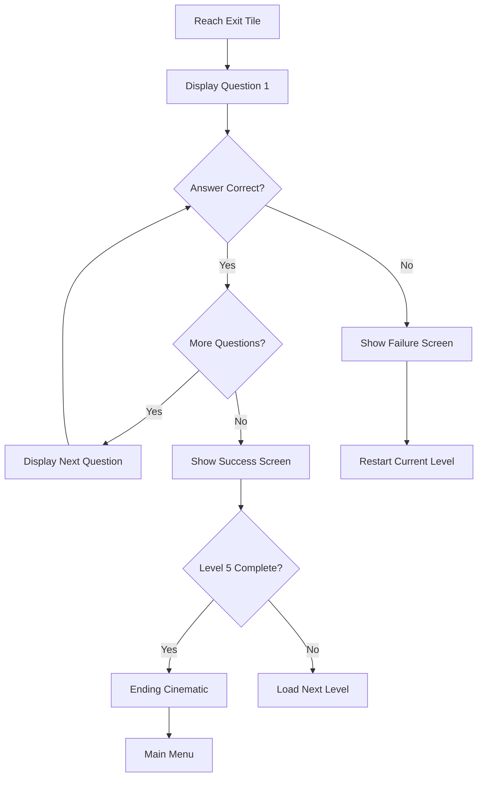

## Level Progression Overview

Una Aventura Inesperada features **5 progressively challenging levels** (nivel1 through nivel5). Each level introduces new puzzle complexity while testing strategic planning with limited movements.

<Info>
Levels are stored as tile arrays in `teselas.h` and loaded via the `GenerarNivel()` function (source/main.c:792-848).
</Info>

## Movement Limits Per Level

Each level has a strict stamina budget defined by macros:

```c
// From source/main.c:49-53
#define MOVIMIENTOS_NIV1 18
#define MOVIMIENTOS_NIV2 19
#define MOVIMIENTOS_NIV3 23
#define MOVIMIENTOS_NIV4 21
#define MOVIMIENTOS_NIV5 24
```

<CardGroup cols={3}>
  <Card title="Level 1" icon="1">
    **18 Movements**
    
    Tutorial-style introduction with basic mechanics
  </Card>
  
  <Card title="Level 2" icon="2">
    **19 Movements**
    
    Slight increase for added complexity
  </Card>
  
  <Card title="Level 3" icon="3">
    **23 Movements**
    
    Largest movement budget for complex puzzles
  </Card>
  
  <Card title="Level 4" icon="4">
    **21 Movements**
    
    Reduced stamina requiring efficiency
  </Card>
  
  <Card title="Level 5" icon="5">
    **24 Movements**
    
    Final challenge with maximum complexity
  </Card>
</CardGroup>

### Stamina Bar Visualization

The movement limit is visualized as a green stamina bar on the bottom screen:

```c
// From source/main.c:808-814
if(numeroMovimientosMax > 0){
    for(int lin =COMIENZO_LINEA_BARRA_ESTAMINA; lin<ALTO_BARRA_ESTAMINA; lin++){
        for(int col=COMIENZO_COLUMNA_BARRA_ESTAMINA; col<ANCHO_BARRA_ESTAMINA;col++){
            fb[lin*256+col] = RGB15(0,30,0);  // Bright green
        }
    }
}
```

**Bar Properties:**
- **Width:** 32 pixels
- **Height:** 155 pixels  
- **Position:** (20, 38) on bottom screen
- **Depletion:** Top-to-bottom as movements are used

## Level-by-Level Breakdown

<Tabs>
  <Tab title="Level 1">
    ### Level 1: Introduction
    
    **Movement Budget:** 18 steps
    
    **Quiz Questions:** 3 questions
    - `Pregunta1-1` - Correct answer: Option 1 (index 1)
    - `Pregunta1-2` - Correct answer: Option 0 (index 0)
    - `Pregunta1-3` - Correct answer: Option 0 (index 0)
    
    **Implementation:**
    ```c
    // From source/main.c:662-679
    case 0:  // Level 1
        if(esJuegoReiniciado == false && 
           CrearDialogo(Pregunta1_1Bitmap,1) && 
           CrearDialogo(Pregunta1_2Bitmap,0) && 
           CrearDialogo(Pregunta1_3Bitmap,0)){
            nivelActual++;
            CrearDialogo(PreguntasAcertadasBitmap,2);
            mapaAcutal = nivel2;
            GenerarNivel(nivel2,HUDBitmap,MOVIMIENTOS_NIV2);
        }else{
            if(esJuegoReiniciado == false){
                CrearDialogo(PreguntaFallidaBitmap,2);
            }
            esJuegoReiniciado = false;
            GenerarNivel(nivel1,HUDBitmap,MOVIMIENTOS_NIV1);
        }
        break;
    ```
    
    **Progression:**
    - All 3 questions must be answered correctly
    - Success → Success screen → Level 2
    - Failure → Failure screen → Restart Level 1
    
    <Note>
    **Starting Cinematic:** Before Level 1 begins, players see a 3-frame opening cinematic (`CinematicaInicioF1/F2/F3`) from source/main.c:908-910.
    </Note>
  </Tab>
  
  <Tab title="Level 2">
    ### Level 2: Escalation
    
    **Movement Budget:** 19 steps (+1 from Level 1)
    
    **Quiz Questions:** 2 questions
    - `Pregunta2-1` - Correct answer: Option 0
    - `Pregunta2-2` - Correct answer: Option 0
    
    **Implementation:**
    ```c
    // From source/main.c:682-700
    case 1:  // Level 2
        if((esJuegoReiniciado == false && CrearDialogo(Pregunta2_1Bitmap,0)) && 
           CrearDialogo(Pregunta2_2Bitmap,0)){
            nivelActual++;
            CrearDialogo(PreguntasAcertadasBitmap,2);
            mapaAcutal = nivel3;
            GenerarNivel(nivel3,HUDBitmap,MOVIMIENTOS_NIV3);
        }else{
            if(esJuegoReiniciado == false){
                CrearDialogo(PreguntaFallidaBitmap,2);
            }
            esJuegoReiniciado = false;
            GenerarNivel(nivel2,HUDBitmap,MOVIMIENTOS_NIV2);
        }
        break;
    ```
    
    **Progression:**
    - Both questions must be answered correctly
    - Success → Success screen → Level 3
    - Failure → Failure screen → Restart Level 2
  </Tab>
  
  <Tab title="Level 3">
    ### Level 3: Complexity Peak
    
    **Movement Budget:** 23 steps (+4 from Level 2, highest budget)
    
    **Quiz Questions:** 2 questions
    - `Pregunta3-1` - Correct answer: Option 0
    - `Pregunta3-2` - Correct answer: Option 0
    
    **Implementation:**
    ```c
    // From source/main.c:702-720
    case 2:  // Level 3
        if((esJuegoReiniciado == false && CrearDialogo(Pregunta3_1Bitmap,0)) && 
           CrearDialogo(Pregunta3_2Bitmap,0)){
            nivelActual++;
            CrearDialogo(PreguntasAcertadasBitmap,2);
            mapaAcutal = nivel4;
            GenerarNivel(nivel4,HUDBitmap,MOVIMIENTOS_NIV4);
        }else{
            if(esJuegoReiniciado == false){
                CrearDialogo(PreguntaFallidaBitmap,2);
            }
            esJuegoReiniciado = false;
            GenerarNivel(nivel3,HUDBitmap,MOVIMIENTOS_NIV3);
        }
        break;
    ```
    
    **Progression:**
    - Both questions must be answered correctly
    - Success → Success screen → Level 4
    - Failure → Failure screen → Restart Level 3
    
    <Info>
    Level 3 has the most movements available, suggesting larger or more complex puzzle layouts.
    </Info>
  </Tab>
  
  <Tab title="Level 4">
    ### Level 4: Efficiency Test
    
    **Movement Budget:** 21 steps (-2 from Level 3)
    
    **Quiz Questions:** 1 question
    - `Pregunta4` - Correct answer: Option 0
    
    **Implementation:**
    ```c
    // From source/main.c:722-740
    case 3:  // Level 4
        if((esJuegoReiniciado == false && CrearDialogo(Pregunta4Bitmap,0))){
            nivelActual++;
            CrearDialogo(PreguntasAcertadasBitmap,2);
            mapaAcutal = nivel5;
            GenerarNivel(nivel5,HUDBitmap,MOVIMIENTOS_NIV5);
        }else{
            if(esJuegoReiniciado == false){
                CrearDialogo(PreguntaFallidaBitmap,2);
            }
            esJuegoReiniciado = false;
            GenerarNivel(nivel4,HUDBitmap,MOVIMIENTOS_NIV4);
        }
        break;
    ```
    
    **Progression:**
    - Only 1 question (fewer quiz questions as levels progress)
    - Success → Success screen → Level 5
    - Failure → Failure screen → Restart Level 4
    
    <Warning>
    The reduced movement budget tests player efficiency and route optimization.
    </Warning>
  </Tab>
  
  <Tab title="Level 5">
    ### Level 5: Final Challenge
    
    **Movement Budget:** 24 steps (+3 from Level 4, maximum)
    
    **Quiz Questions:** 2 questions
    - `Pregunta5-1` - Correct answer: Option 0
    - `Pregunta5-2` - Correct answer: Option 1
    
    **Implementation:**
    ```c
    // From source/main.c:742-764
    case 4:  // Level 5
        if((esJuegoReiniciado == false && CrearDialogo(Pregunta5_1Bitmap,0)) && 
           CrearDialogo(Pregunta5_2Bitmap,1)){
            nivelActual++;
            CrearDialogo(PreguntasAcertadasFinalBitmap,2);
            
            // Ending cinematic
            CrearDialogo(CinematicaFinalF1Bitmap,2);
            CrearDialogo(CinematicaFinalF2Bitmap,2);
            CrearDialogo(CinematicaFinalF3Bitmap,2);
            CrearMenu(menuTitulo,menuPrincipalBitmap,menuCreditosBitmap);
        }else{
            if(esJuegoReiniciado == false){
                CrearDialogo(PreguntaFallidaBitmap,2);
            }
            esJuegoReiniciado = false;
            GenerarNivel(nivel5,HUDBitmap,MOVIMIENTOS_NIV5);
        }
        break;
    ```
    
    **Progression:**
    - Both questions must be answered correctly
    - Success → Final success screen → **Ending cinematic** → Return to main menu
    - Failure → Failure screen → Restart Level 5
    
    <Check>
    **Game Completion:** Beating Level 5 triggers the 3-frame ending cinematic and returns players to the main menu, allowing them to replay the adventure.
    </Check>
  </Tab>
</Tabs>

## Quiz Question System

Questions are presented as bitmap images displayed on the bottom screen with two clickable answer regions.

### Question Assets

All quiz questions are imported as bitmap headers:

```c
// From source/main.c:27-39
#include "Pregunta1-1.h"
#include "Pregunta1-2.h"
#include "Pregunta1-3.h"
#include "Pregunta2-1.h"
#include "Pregunta2-2.h"
#include "Pregunta3-1.h"
#include "Pregunta3-2.h"
#include "Pregunta4.h"
#include "Pregunta5-1.h"
#include "Pregunta5-2.h"
#include "PreguntaFallida.h"
#include "PreguntasAcertadas.h"
#include "PreguntasAcertadasFinal.h"
```

### Answer Validation

The `CrearDialogo()` function handles all quiz logic:

```c
// From source/main.c:939-975
bool CrearDialogo(unsigned int imagen[], int opcionCorrecta){
    // Display question image
    dmaCopy(imagen, VRAM_A, 256*192*2);
    
    // Wait for touch input on one of two buttons
    // Button 1: (50,138) to (213,161)
    // Button 2: (50,165) to (213,189)
    
    // Return true if chosen option matches opcionCorrecta
    return (opcionElegida == opcionCorrecta);
}
```

<Accordion title="Answer Index System">
  - **Option 0** = First answer (top button)
  - **Option 1** = Second answer (bottom button)
  - **Option 2** = Any answer acceptable (used for info screens)
  
  Example from Level 1:
  ```c
  CrearDialogo(Pregunta1_1Bitmap, 1)  // Second answer is correct
  CrearDialogo(Pregunta1_2Bitmap, 0)  // First answer is correct
  ```
</Accordion>

### Quiz Flow Diagram



## Cinematic System

### Opening Cinematic

Triggered when starting a new game:

```c
// From source/main.c:907-914
if(/* Start button pressed */){
    CrearDialogo(CinematicaInicioF1Bitmap,2);
    CrearDialogo(CinematicaInicioF2Bitmap,2);
    CrearDialogo(CinematicaInicioF3Bitmap,2);
    mapaAcutal = nivel1;
    GenerarNivel(nivel1,HUDBitmap,MOVIMIENTOS_NIV1);
    esJuegoComenzado = true;
}
```

**Assets:**
- `CinematicaInicioF1.h` - Frame 1
- `CinematicaInicioF2.h` - Frame 2
- `CinematicaInicioF3.h` - Frame 3

### Ending Cinematic

Triggered after completing Level 5:

```c
// From source/main.c:750-754
CrearDialogo(PreguntasAcertadasFinalBitmap,2);
CrearDialogo(CinematicaFinalF1Bitmap,2);
CrearDialogo(CinematicaFinalF2Bitmap,2);
CrearDialogo(CinematicaFinalF3Bitmap,2);
CrearMenu(menuTitulo,menuPrincipalBitmap,menuCreditosBitmap);
```

**Assets:**
- `CinematicaFinalF1.h` - Frame 1
- `CinematicaFinalF2.h` - Frame 2  
- `CinematicaFinalF3.h` - Frame 3

<Info>
**Cinematic Navigation:** All cinematic frames use `opcionCorrecta = 2`, meaning players tap anywhere on the touch screen to advance to the next frame.
</Info>

## Level Restart System

Players can restart the current level at any time during gameplay.

### Restart Button

The restart button appears on the HUD during active gameplay:

```c
// From source/main.c:143-146
struct PuntoPantalla puntosReinicioNivelBoton [2]={
    {117,100},  // Top-left corner
    {236,125}   // Bottom-right corner
};
```

**Button Properties:**
- **Position:** (117, 100) on bottom screen
- **Size:** 119×25 pixels
- **Activation:** Only when `esActivoBotonReinicio == true` (source/main.c:220)

### Restart Implementation

The main loop monitors for restart touches:

```c
// From source/main.c:220-233
if(esActivoBotonReinicio == true){
    scanKeys();
    keys = keysCurrent();
    if(keys & KEY_TOUCH && esActivoBotonesDialogos == true){
        touchRead(&posicionXY);
        if((posicionXY.px >= puntosReinicioNivelBoton[0].x && 
            posicionXY.px <= puntosReinicioNivelBoton[1].x) && 
           (posicionXY.py >= puntosReinicioNivelBoton[0].y && 
            posicionXY.py <= puntosReinicioNivelBoton[1].y)){
            esJuegoReiniciado = true;
            ConsultarSistemaDialogo();  // Triggers level reload
        }
    }
}
```

### Restart Flow

When restart is triggered:

1. `esJuegoReiniciado` flag set to `true`
2. `ConsultarSistemaDialogo()` called
3. Current level's case statement executed
4. Quiz questions skipped (due to `esJuegoReiniciado` check)
5. Level regenerated with `GenerarNivel()`
6. Flag reset to `false`

```c
// From source/main.c:677-678 (example from Level 1)
if(esJuegoReiniciado == false){
    CrearDialogo(PreguntaFallidaBitmap,2);  // Skipped on manual restart
}
esJuegoReiniciado = false;
GenerarNivel(nivel1,HUDBitmap,MOVIMIENTOS_NIV1);
```

<Note>
**Restart vs. Failure:** Manual restarts skip the failure dialog, while quiz failures show the `PreguntaFallidaBitmap` before restarting.
</Note>

## Level Generation

The `GenerarNivel()` function (source/main.c:792-848) handles all level initialization:

```c
void GenerarNivel(u16 mapa[], unsigned int imagen[], int numeroMovimientosMax){
    // Resume animations
    timerUnpause(1);
    
    // Enable gameplay
    REG_KEYCNT = 0x7FFF;
    esActivoBotonReinicio = true;
    esPartidaAcabada = false;
    jugadorVivo = true;
    
    // Display HUD on bottom screen
    dmaCopy(imagen, VRAM_A, 256*192*2);
    REG_DISPCNT = MODE_FB0;
    
    // Set movement budget
    movimientosJugador = numeroMovimientosMax;
    maximoMovimientosJugador = numeroMovimientosMax;
    
    // Draw stamina bar (green)
    if(numeroMovimientosMax > 0){
        for(int lin=COMIENZO_LINEA_BARRA_ESTAMINA; lin<ALTO_BARRA_ESTAMINA; lin++){
            for(int col=COMIENZO_COLUMNA_BARRA_ESTAMINA; col<ANCHO_BARRA_ESTAMINA; col++){
                fb[lin*256+col] = RGB15(0,30,0);
            }
        }
    }
    
    // Generate tile map
    int fila, columna, contEnemigos=0;
    numeroDeEnemigos = 0;
    pos_mapData = 0;
    
    for(fila=0; fila<24; fila++)
        for(columna=0; columna<32; columna++){
            pos_mapMemory = fila*32+columna;
            mapMemory[pos_mapMemory] = mapa[pos_mapData];
            
            // Track player start position
            if(mapMemory[pos_mapMemory] == 0){
                posJugColumna = columna;
                posJugFila = fila;
            }
            // Track NPC position
            else if(mapMemory[pos_mapMemory] == 38){
                posNpcColumna = columna;
                posNpcFila = fila;
            }
            // Track enemy positions
            else if(mapMemory[pos_mapMemory] == 5 || mapMemory[pos_mapMemory] == 42){
                posicionesEnemigo[contEnemigos].x = columna;
                posicionesEnemigo[contEnemigos].y = fila;
                posicionesEnemigo[contEnemigos].vivo = true;
                contEnemigos++;
                numeroDeEnemigos++;
            }
            pos_mapData++;
        }
}
```

### Level Data Structure

Levels are stored as 1D arrays of 768 elements (32×24 tiles):
- **Tile 0:** Player start position
- **Tile 38:** NPC position
- **Tile 5/42:** Enemy positions
- **Other tiles:** Walls, floors, grass, boxes, etc.

<Warning>
**Maximum Enemies:** The game supports up to 10 enemies per level (source/main.c:148). Exceeding this limit will cause array overflow.
</Warning>

## Level Progression Table

| Level | Movements | Questions | Question IDs | Correct Answers | Next Level |
|-------|-----------|-----------|--------------|-----------------|------------|
| **1** | 18 | 3 | Pregunta1-1<br/>Pregunta1-2<br/>Pregunta1-3 | 1<br/>0<br/>0 | Level 2 |
| **2** | 19 | 2 | Pregunta2-1<br/>Pregunta2-2 | 0<br/>0 | Level 3 |
| **3** | 23 | 2 | Pregunta3-1<br/>Pregunta3-2 | 0<br/>0 | Level 4 |
| **4** | 21 | 1 | Pregunta4 | 0 | Level 5 |
| **5** | 24 | 2 | Pregunta5-1<br/>Pregunta5-2 | 0<br/>1 | Ending |

<Check>
**Total Quiz Questions:** 10 questions across all 5 levels must be answered correctly to complete the game.
</Check>