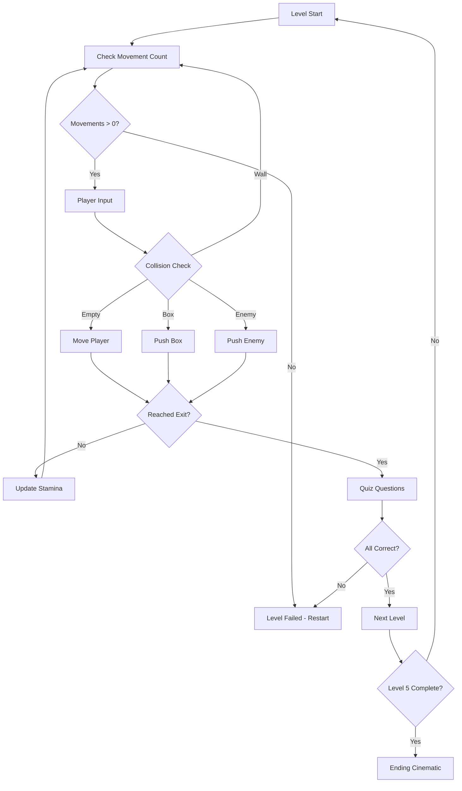

## Game Concept

**Una Aventura Inesperada** (An Unexpected Adventure) is a grid-based puzzle game developed for the Nintendo DS using C and devkitpro. The game challenges players to navigate through five increasingly complex levels while managing limited movement resources and answering quiz questions.

<Note>
The game was created by Juan José Gómez Simón (version 0.8, December 2020) as a puzzle game that combines strategic movement with educational elements.
</Note>

## Story and Setting

Players embark on an unexpected adventure through a tile-based world filled with obstacles, enemies, and challenges. The journey is framed by cinematics:

<Accordion title="Opening Cinematic">
The game begins with a three-frame opening sequence that sets the stage for your adventure:
- `CinematicaInicioF1` - Frame 1
- `CinematicaInicioF2` - Frame 2
- `CinematicaInicioF3` - Frame 3

These cinematics are displayed when the player starts a new game from the main menu (source/main.c:908-910).
</Accordion>

<Accordion title="Ending Cinematic">
Upon completing all five levels, players are rewarded with a closing cinematic:
- `CinematicaFinalF1` - Frame 1
- `CinematicaFinalF2` - Frame 2
- `CinematicaFinalF3` - Frame 3

The ending sequence celebrates your successful completion of the adventure (source/main.c:751-753).
</Accordion>

## Core Objective

The primary goal is to **reach the exit tile (meta) in each level** while adhering to strict movement limitations. Each level requires:

1. **Strategic planning** - Plan your route with limited stamina
2. **Obstacle manipulation** - Push boxes to clear paths
3. **Enemy elimination** - Remove enemies blocking your way
4. **Quiz completion** - Answer educational questions correctly

<Warning>
Running out of movements before reaching the exit results in failure. You must restart the level if you cannot reach the goal.
</Warning>

## Win Conditions

### Level Completion

To complete a level, you must:

<Steps>
  <Step title="Reach the Exit">
    Navigate to the goal tile (`case 23` in `ElegirFondoJugador` function) which triggers the dialog system (source/main.c:476).
  </Step>
  
  <Step title="Answer Quiz Questions">
    Correctly answer all quiz questions presented after reaching the exit. Wrong answers force a level restart.
  </Step>
  
  <Step title="Progress to Next Level">
    Upon success, you'll see a "Questions Answered" confirmation (`PreguntasAcertadasBitmap`) and advance to the next level.
  </Step>
</Steps>

### Game Completion

Complete all five levels (nivel1 through nivel5) to finish the game and unlock the ending cinematic.

## Core Gameplay Loop

The game follows a consistent loop throughout all levels:



### Loop Breakdown

<Tabs>
  <Tab title="Movement Phase">
    **Check Available Movements**
    
    Each level starts with a specific stamina count:
    - Level 1: 18 movements
    - Level 2: 19 movements
    - Level 3: 23 movements
    - Level 4: 21 movements
    - Level 5: 24 movements
    
    The stamina bar depletes with each move (source/main.c:853-862).
  </Tab>
  
  <Tab title="Action Phase">
    **Execute Actions**
    
    Players can:
    - Move to empty tiles (grass, exit)
    - Push boxes to adjacent tiles
    - Eliminate enemies by pushing them into obstacles
    - Cannot move through walls or void tiles
    
    All actions consume 1 movement point.
  </Tab>
  
  <Tab title="Evaluation Phase">
    **Check Win/Fail Conditions**
    
    - If exit reached → Quiz questions
    - If movements depleted → Level restart
    - If quiz failed → Level restart
    - If quiz passed → Next level
  </Tab>
</Tabs>

## Progression System

### Level Structure

The game features 5 distinct levels with increasing difficulty:

<CardGroup cols={2}>
  <Card title="Level 1" icon="1">
    **18 Movements**
    
    Introduction level with 3 quiz questions (Pregunta1-1, 1-2, 1-3)
  </Card>
  
  <Card title="Level 2" icon="2">
    **19 Movements**
    
    Increased complexity with 2 quiz questions (Pregunta2-1, 2-2)
  </Card>
  
  <Card title="Level 3" icon="3">
    **23 Movements**
    
    Larger maps requiring 2 quiz questions (Pregunta3-1, 3-2)
  </Card>
  
  <Card title="Level 4" icon="4">
    **21 Movements**
    
    Advanced puzzles with 1 quiz question (Pregunta4)
  </Card>
  
  <Card title="Level 5" icon="5">
    **24 Movements**
    
    Final challenge with 2 quiz questions (Pregunta5-1, 5-2)
  </Card>
</CardGroup>

### Quiz System

Between levels, players must answer quiz questions correctly:

- **Two answer options** displayed on the bottom screen
- **Touch screen selection** (source/main.c:956-960)
- **Binary evaluation** - correct or incorrect, no partial credit
- **Immediate feedback** - success screen or failure screen

<Info>
The quiz system is implemented in `CrearDialogo()` function (source/main.c:939-975) which displays questions and validates answers against the correct option.
</Info>

### Restart System

Failing a level triggers the restart system:

```c
// From source/main.c:674-678
if(esJuegoReiniciado == false){
    CrearDialogo(PreguntaFallidaBitmap,2);
}
esJuegoReiniciado = false;
GenerarNivel(nivel1,HUDBitmap,MOVIMIENTOS_NIV1);
```

Players can also manually restart using the restart button on the HUD during gameplay (source/main.c:220-233).

## Visual Feedback

The game provides several visual indicators:

- **Stamina Bar** - Green bar showing remaining movements (source/main.c:809-814)
- **Animated Sprites** - Player, NPCs, and enemies have 2-frame animations
- **HUD Display** - Bottom screen shows game information and restart button
- **Dialog Screens** - Full-screen images for questions and cinematics

<Check>
**Key Success Metrics:**
- Efficient movement usage
- Strategic box placement
- Enemy elimination
- Quiz accuracy
- Level completion time
</Check>